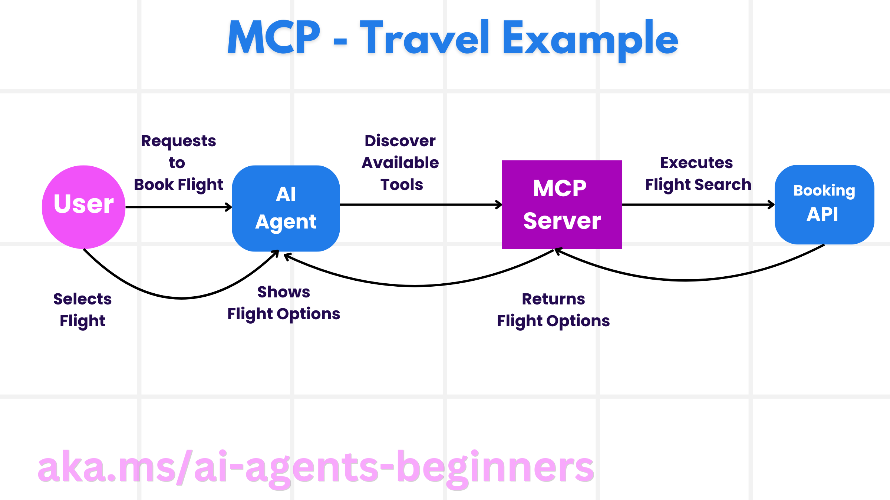
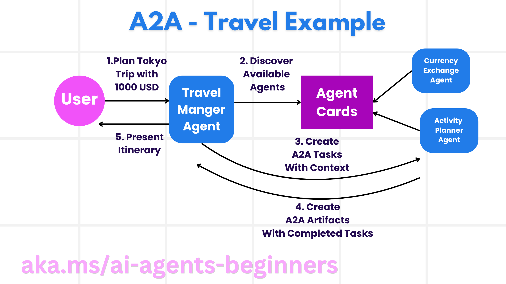

# Using Agentic Protocols (MCP, A2A and NLWeb)

//todo: for game agent, add mcp capability, call it agent_v61a.py in apps-psr/psr-game-agent. follow agent_v1.py
//todo: for game agent, add A2A, call it agent_v61b.py in apps-psr/psr-game-agent. follow agent_v1.py

As the use of AI agents grows, so does the need for protocols that ensure standardization, security, and support open innovation. In this lesson, we will cover 3 protocols looking to meet this need - Model Context Protocol (MCP), Agent to Agent (A2A) and Natural Language Web (NLWeb).

## Model Context Protocol

The **Model Context Protocol (MCP)** is an open standard that provides standardized way for applications to provide context and tools to LLMs. This enables a "universal adaptor" to different data sources and tools that AI Agents can connect to in a consistent way.

Let’s look at the components of MCP, the benefits compared to direct API usage, and an example of how AI agents might use an MCP server.

### MCP Core Components

MCP operates on a **client-server architecture** and the core components are:

• **Hosts** are LLM applications (for example a code editor like VSCode) that start the connections to an MCP Server.

• **Clients** are components within the host application that maintain one-to-one connections with servers.

• **Servers** are lightweight programs that expose specific capabilities.

Included in the protocol are three core primitives which are the capabilities of an MCP Server:

• **Tools**: These are discrete actions or functions an AI agent can call to perform an action. For example, a weather service might expose a "get weather" tool, or an e-commerce server might expose a "purchase product" tool. MCP servers advertise each tool's name, description, and input/output schema in their capabilities listing.

• **Resources**: These are read-only data items or documents that an MCP server can provide, and clients can retrieve them on demand. Examples include file contents, database records, or log files. Resources can be text (like code or JSON) or binary (like images or PDFs).

• **Prompts**: These are predefined templates that provide suggested prompts, allowing for more complex workflows.

### Benefits of MCP

MCP offers significant advantages for AI Agents:

• **Dynamic Tool Discovery**: Agents can dynamically receive a list of available tools from a server along with descriptions of what they do. This contrasts with traditional APIs, which often require static coding for integrations, meaning any API change necessitates code updates. MCP offers an "integrate once" approach, leading to greater adaptability.

• **Interoperability Across LLMs**: MCP works across different LLMs, providing flexibility to switch core models to evaluate for better performance.

• **Standardized Security**: MCP includes a standard authentication method, improving scalability when adding access to additional MCP servers. This is simpler than managing different keys and authentication types for various traditional APIs.

### MCP Example

Imagine a player wants to get tournament assistance using an AI agent powered by MCP.

1. **Connection**: The PSR Tournament Agent (the MCP client) connects to an MCP server provided by a tournament knowledge service.

2. **Tool Discovery**: The client asks the knowledge service's MCP server, "What tools do you have available?" The server responds with tools like "answer_question", "analyze_strategy", and "get_opponent_stats".

3. **Tool Invocation**: The tournament presents a question: "What is the capital of France?" The PSR Agent, using its LLM, identifies that it needs to call the "answer_question" tool and passes the relevant parameters (question, difficulty_level) to the MCP server.

4. **Execution and Response**: The MCP server, acting as a wrapper, makes the actual call to the knowledge service's internal database API. It then receives the answer information (e.g., JSON data with answer and confidence) and sends it back to the PSR Agent.

5. **Further Interaction**: The PSR Agent receives the answer "Paris" with high confidence. For the same round, it might also invoke the "analyze_strategy" tool on the same MCP server to determine the optimal Rock/Paper/Scissors move, completing the tournament round submission.

## Agent-to-Agent Protocol (A2A)

While MCP focuses on connecting LLMs to tools, the **Agent-to-Agent (A2A) protocol** takes it a step further by enabling communication and collaboration between different AI agents.  A2A connects AI agents across different organizations, environments and tech stacks to complete a shared task.

We’ll examine the components and benefits of A2A, along with an example of how it could be applied in our travel application.

### A2A Core Components

A2A focuses on enabling communication between agents and having them work together to complete a subtask of user. Each component of the protocol contributes to this:

#### Agent Card

Similar to how an MCP server shares a list of tools, an Agent Card has:
- The Name of the Agent .
- A **description of the general tasks** it completes.
- A **list of specific skills** with descriptions to help other agents (or even human users) understand when and why they would want to call that agent.
- The **current Endpoint URL** of the agent
- The **version** and **capabilities** of the agent such as streaming responses and push notifications.

#### Agent Executor

The Agent Executor is responsible for **passing the context of the user chat to the remote agent**, the remote agent needs this to understand the task that needs to be completed. In an A2A server, an agent uses its own Large Language Model (LLM) to parse incoming requests and execute tasks using its own internal tools.

#### Artifact

Once a remote agent has completed the requested task, its work product is created as an artifact.  An artifact **contains the result of the agent's work**, a **description of what was completed**, and the **text context** that is sent through the protocol. After the artifact is sent, the connection with the remote agent is closed until it is needed again.

#### Event Queue

This component is used for **handling updates and passing messages**. It is particularly important in production for agentic systems to prevent the connection between agents from being closed before a task is completed, especially when task completion times can take a longer time.

### Benefits of A2A

• **Enhanced Collaboration**: It enables agents from different vendors and platforms to interact, share context, and work together, facilitating seamless automation across traditionally disconnected systems.

• **Model Selection Flexibility**: Each A2A agent can decide which LLM it uses to service its requests, allowing for optimized or fine-tuned models per agent, unlike a single LLM connection in some MCP scenarios.

• **Built-in Authentication**: Authentication is integrated directly into the A2A protocol, providing a robust security framework for agent interactions.

### A2A Example

Let's expand on our PSR tournament scenario, but this time using A2A to coordinate multiple specialized agents.

1. **User Request to Multi-Agent**: A tournament coordinator interacts with a "Tournament Manager" A2A client/agent, perhaps by saying, "Please handle the complete tournament round for all 10 players, including question validation, strategy analysis, and performance tracking".

2. **Orchestration by Tournament Manager**: The Tournament Manager receives this complex request. It uses its LLM to reason about the task and determine that it needs to interact with other specialized agents for different aspects of tournament management.

3. **Inter-Agent Communication**: The Tournament Manager then uses the A2A protocol to connect to downstream agents, such as a "Question Specialist Agent," a "Strategy Analysis Agent," and a "Performance Monitor Agent" that could be created by different organizations or use different AI models.

4. **Delegated Task Execution**: The Tournament Manager sends specific tasks to these specialized agents (e.g., "Validate all player answers for this question," "Analyze optimal moves for current game state," "Track player performance metrics"). Each of these specialized agents, running their own LLMs and utilizing their own tools (which could be MCP servers themselves), performs its specific part of the tournament management.

5. **Consolidated Response**: Once all downstream agents complete their tasks, the Tournament Manager compiles the results (answer validations, strategic recommendations, performance reports) and sends a comprehensive response back to the tournament coordinator with complete round results and insights.

## Natural Language Web (NLWeb)

Websites have long been the primary way for users to access information and data across the internet.

Let us look at the different components of NLWeb, the benefits of NLWeb and an example how our NLWeb works by looking at our travel application.

### Components of NLWeb

- **NLWeb Application (Core Service Code)**: The system that processes natural language questions. It connects the different parts of the platform to create responses. You can think of it as the **engine that powers the natural language features** of a website.

- **NLWeb Protocol**: This is a **basic set of rules for natural language interaction** with a website. It sends back responses in JSON format (often using Schema.org). Its purpose is to create a simple foundation for the “AI Web,” in the same way that HTML made it possible to share documents online.

- **MCP Server (Model Context Protocol Endpoint)**: Each NLWeb setup also works as an **MCP server**. This means it can **share tools (like an “ask” method) and data** with other AI systems. In practice, this makes the website’s content and abilities usable by AI agents, allowing the site to become part of the wider “agent ecosystem.”

- **Embedding Models**: These models are used to **convert website content into numerical representations called vectors** (embeddings). These vectors capture meaning in a way computers can compare and search. They are stored in a special database, and users can choose which embedding model they want to use.

- **Vector Database (Retrieval Mechanism)**: This database **stores the embeddings of the website content**. When someone asks a question, NLWeb checks the vector database to quickly find the most relevant information. It gives a fast list of possible answers, ranked by similarity. NLWeb works with different vector storage systems such as Qdrant, Snowflake, Milvus, Azure AI Search, and Elasticsearch.

### NLWeb by Example

Consider our travel booking website again, but this time, it's powered by NLWeb.

1. **Data Ingestion**: The travel website's existing product catalogs (e.g., flight listings, hotel descriptions, tour packages) are formatted using Schema.org or loaded via RSS feeds. NLWeb's tools ingest this structured data, create embeddings, and store them in a local or remote vector database.

2. **Natural Language Query (Human)**: A user visits the website and, instead of navigating menus, types into a chat interface: "Find me a family-friendly hotel in Honolulu with a pool for next week".

3. **NLWeb Processing**: The NLWeb application receives this query. It sends the query to an LLM for understanding and simultaneously searches its vector database for relevant hotel listings.

4. **Accurate Results**: The LLM helps to interpret the search results from the database, identify the best matches based on "family-friendly," "pool," and "Honolulu" criteria, and then formats a natural language response. Crucially, the response refers to actual hotels from the website's catalog, avoiding made-up information.

5. **AI Agent Interaction**: Because NLWeb serves as an MCP server, an external AI travel agent could also connect to this website's NLWeb instance. The AI agent could then use the `ask` MCP method to query the website directly: `ask("Are there any vegan-friendly restaurants in the Honolulu area recommended by the hotel?")`. The NLWeb instance would process this, leveraging its database of restaurant information (if loaded), and return a structured JSON response.

